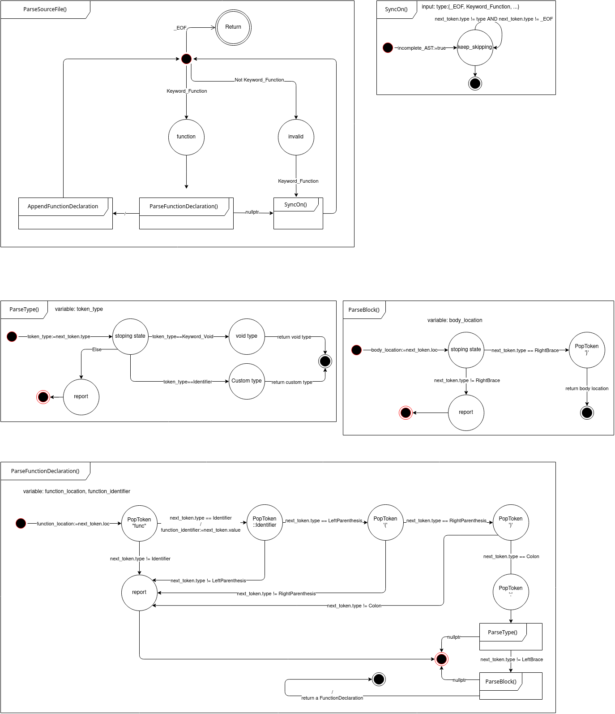

# A_Language is my simple language. [In Progress]

---

## Lexer
The lexer is the first step in the compilation process and it is the first part of the A_Language compiler to be implemented.

The lexer outlined in this document is a simple lexer that is capable of tokenizing the following tokens:
- Keywords: `func`, `num`, `void`, `if`, `else`, `while`, `return`, `const`, `string`, `var`, `int`, `float`

- Identifiers
- Numbers (integers and floats)
- Strings
- Operators: `+`, `-`, `*`, `/`, `=`, `==`, `<`, `>`, `&`, `&&`, `|`, `||`, `!`
- Delimiters: `(`, `)`, `{`, `}`, `[`, `]`, `,`, `;`
- Comments: `//`

---
## Paser  *so far*
The parser is the second step in the compilation process and it is the second part of the A_Language compiler to be implemented. To this point the parser is capable of parsing the following:
- Function declarations *no parameters so far*
- Type declarations: `void`, custom types
- Block statements *simple so far*

The language has the functions as the main and only building block. The functions can be declared with the following syntax:
```A_Language
func main() : void {
    // code goes here
}
```
### Parser state machines diagram


---
## Grammar for the language *so far*
The grammer rules for the A_Language are written in BNF form. The grammar rules are listed in the [`grammar.md`](grammar.md) file.

---
## Known limitations
- The lexer assumes that the input file is an ascii file.
- The lexer assumes that the input file is a valid A_Language program. It does not check for syntax errors yet.
- The lexer does not recognize the following tokens:
  - `+=`, `-=`, `*=`, `/=`, `++`, `--`
  - `+=`, `-=`, `*=`, `/=`, `++`, `--`
  - `<<`, `>>`, `^`, `~`, `->`, `::`
  - `<<=`, `>>=`, `&=`, `|=`, `^=`
- The lexer does not support multi-line comments.